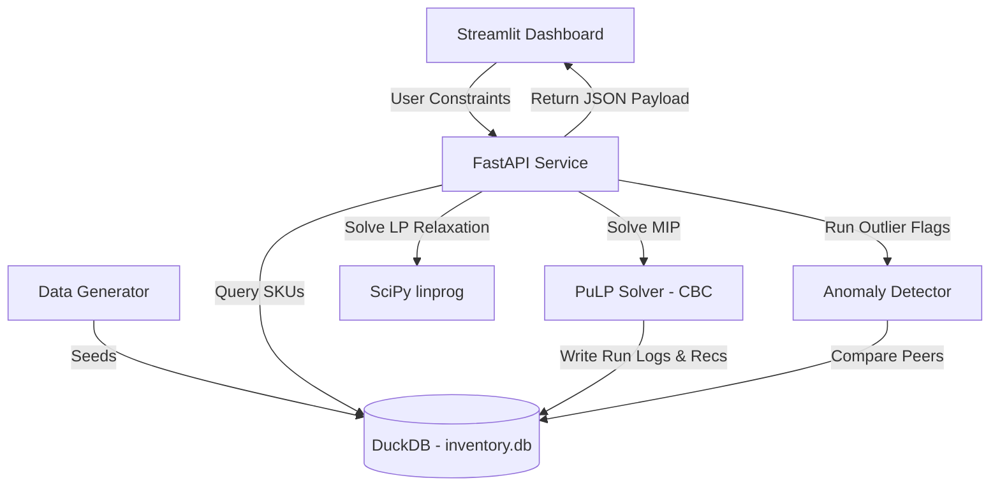

# Production-Style Inventory Cost Optimization & Negotiation System

This repository implements a production-grade **Inventory Cost Optimization & Cost Anomaly Detection system** tailored for a multi-SKU retail supply chain.

Designed to mirror an internal deliverable for a retail Data Science & Engineering team, this project addresses key capabilities outlined in supply chain roles:
1. **Supply Chain Cost Optimization**: Robust anomaly detection to flag supplier pricing deviations and negotiation margins.
2. **Supply Chain Forecasting & Optimization**: Formulating and solving Mixed-Integer Programming (MIP) models to optimize SKU-level replenishment under warehouse, budget, supplier, and service-level constraints.

---

## 🚀 Key Business Outcomes (Simulated Results)
*All metrics reported here are simulated using a generated catalog of 1,000 SKUs.*
- **Expected Cost Reduction**: **37.53%** reduction in weekly supply chain costs ($1,777,598.35 saved on holding + stockout costs compared to a naive reorder policy) under the default configuration.
- **Service Level Achieved**: Achieves **95.22% aggregate fill rate** under default settings, successfully meeting the target 95% service level floor.
- **Negotiation Opportunities Flagged**: Identifies **~60 cost outliers** among comparable style groups (material/category combos), exposing **over $58,000 in immediate procurement savings** when renegotiated to the peer group median.

> [!NOTE]
> **Target vs. Achieved Service Level**: The "Target" service level (slider in the sidebar) acts as a mathematical lower bound (floor) for the optimization model. The "Achieved" service level (KPI card output) is the actual resulting fill rate achieved by the optimal order recommendation across all scenarios (which can slightly exceed the target floor, e.g., 95.22% achieved vs. 95.0% target floor, as the solver optimizes orders in discrete MOQs).

---

## 🛠️ System Architecture

The application is structured as a decoupled microservice architecture:
- **Data Layer (DuckDB)**: Embedded high-performance SQL database storing the SKU master records and logging solver execution history (MLOps run logs).
- **Optimization Engine (PuLP / SciPy)**: Formulates and solves a Mixed-Integer Linear Program (MIP) using Sample Average Approximation (SAA) to account for demand variance. Swaps to SciPy for LP relaxations to compute constraint shadow prices.
- **Cost Anomaly Detection (Robust Stats)**: Uses median and Interquartile Range (IQR) pricing thresholds within fabric-level peer groups to identify negotiation margins.
- **API Layer (FastAPI)**: REST endpoints exposing `/optimize`, `/anomalies`, `/scenario`, and `/health` using Pydantic validation.
- **Dashboard (Streamlit)**: Styled with a luxury retail aesthetic (charcoal base `#0F0F10`, blush pink `#F9D3D8`, champagne gold `#E6C17A` accents).



---

## 📂 Repository Structure

```text
inventory_cost_optimisation/
├── data/                       # Local DuckDB database file
├── src/
│   ├── data_generator.py       # Seeding catalog with comparable fabric groups & anomalies
│   ├── database.py             # DuckDB schema management and query interface
│   ├── optimization/
│   │   ├── formulation.py      # PuLP MIP & SciPy LP relaxation solvers (SAA)
│   │   └── sensitivity.py      # What-if sensitivity analysis (empirical shadow prices)
│   ├── anomaly_detection/
│   │   └── detector.py         # Robust style-group cost anomaly flagging
│   ├── tracking/
│   │   └── tracker.py          # Lightweight run logging (SQL run records)
│   └── api/
│       └── main.py             # FastAPI backend implementation
├── dashboard/
│   └── app.py                  # Streamlit frontend with luxury brand CSS injection
├── tests/
│   ├── test_optimization.py    # Unit tests for MOQ and objective monotonicity
│   └── test_anomaly_detection.py # Unit tests for outlier flagging and savings math
├── docs/
│   └── explainer.md            # Non-jargon concepts guide (LP, MIP, shadow prices, production scaling)
├── Dockerfile.api              # API container setup
├── Dockerfile.dashboard        # Dashboard container setup
├── docker-compose.yml          # Local container orchestrator
└── requirements.txt            # Dependency specifications
```

---

## ⚙️ Setup & Execution

You can run this project locally in Python or spin up the entire system inside Docker.

### Option A: Local Python Run

1. **Clone & Install Dependencies**:
   ```bash
   pip install -r requirements.txt
   ```

2. **Initialize Database**:
   Run the database module to generate the synthetic dataset and seed the tables:
   ```bash
   python -m src.database
   ```

3. **Launch FastAPI Backend**:
   ```bash
   uvicorn src.api.main:app --reload --port 8000
   ```
   *The Swagger API documentation will be available at [http://localhost:8000/docs](http://localhost:8000/docs)*.

4. **Launch Streamlit Dashboard**:
   In a separate terminal window:
   ```bash
   streamlit run dashboard/app.py
   ```
   *The dashboard will launch at [http://localhost:8501](http://localhost:8501)*.
   *(Note: The dashboard features an offline fallback; if the FastAPI server is not running, it runs calculations locally).*

### Option B: Docker Compose (Highly Recommended)

Build and launch the backend and frontend services in linked containers:
```bash
docker-compose up --build
```
Once built, open:
- Streamlit Dashboard: [http://localhost:8501](http://localhost:8501)
- FastAPI Docs: [http://localhost:8000/docs](http://localhost:8000/docs)

---

## 🧪 Testing

We use `pytest` for automated unit testing. The test suite validates solver constraints, check MOQ rules, verify budget boundaries, and check objective monotonicity.

Run the tests with:
```bash
pytest
```
